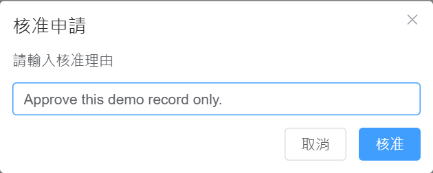

# AI Service Access & Costs

Manage who can use language-model APIs and track the resulting usage and costs.
Staff submit requests; reviewers approve access; administrators review usage and costs.

For internal use. The current deployment has not been checked. The local gateway uses a mock provider by default; this preview does not call a model service.

[Run locally](#run-locally) · [Staff workflow and design](docs/LLM_API_FinOps_V1.1_Strict_Plan.md) · [Backup and restore](docs/Runbook_Backup_Restore.md)



*Real local reviewer UI with its original labels. A sample record was created
through the API and approved through this dialog. No key, provider call,
company data or measured cost saving is shown.*

```text
Sample request: DEMO_ONLY / SAMPLE_RECORD
Before review: PENDING
Decision: Approve this demo record only.
After review: APPROVED
```

This example verifies a recorded review decision. It does not grant access to
a real model account or demonstrate provider billing.

## Run locally

Use Docker Compose and Python 3.10+ on a machine with ports 5432, 6380, 18001, and 5173 available. The Compose file uses fixed container names, so run one copy at a time.

```powershell
git clone https://github.com/SpadesZ/management-system.git
cd management-system
Copy-Item .env.example .env
python -c "import secrets,base64; print(base64.urlsafe_b64encode(secrets.token_bytes(32)).decode())"
python -c "import secrets; print(secrets.token_urlsafe(48))"
```

Put the first generated value in `MASTER_ENCRYPTION_KEY` and the second in `JWT_SECRET_KEY` in `.env`. Keep `GATEWAY_MOCK_PROVIDER=true` for the local demo.

```powershell
docker compose up -d --build
python -m unittest discover -s backend/tests -p "test_smoke_live.py" -v
```

Open [the app](http://localhost:5173) or [API docs](http://localhost:18001/docs). The seed login is `admin@example.com` / `ChangeThisPassword!`; change it before using the app with real data.

The local preview covers login and a recorded approval decision. Current
smoke-check scope and setup limits are listed in the validation notes below.

## Technical details — 繁體中文

The original technical and operations notes follow in Traditional Chinese.

### 本機驗證範圍

2026-10-02：隔離資料庫驗證 health、registration options、registration/login、admin identity，
並以真 UI 將 demo-only request 從 PENDING 改為 APPROVED。既有 container images 提供依賴，
本 checkout 提供 source。未重建完整 image、未驗 provider billing、production deployment 或備份復原。

### LLM API FinOps V1.1

此專案實作內部 LLM API 存取、帳號與成本管理。V1.1 是規劃與程式版本標籤，不代表正式部署或完整驗收。

### 文件入口
- 規劃書：[docs/LLM_API_FinOps_V1.1_Strict_Plan.md](docs/LLM_API_FinOps_V1.1_Strict_Plan.md)

### 技術棧
- Frontend：Vue 3 + Element Plus + ECharts
- Backend：FastAPI
- Database：PostgreSQL
- Cache：Redis
- Background Jobs：Celery/RQ 可替換；目前使用資料庫輪詢 worker
- Deployment：Docker Compose

### 建置來源說明
- Backend/Worker 的 Docker build 只使用 `backend/Dockerfile` 與 `backend/requirements.txt`。
- Frontend 的 Docker build 使用 `frontend/Dockerfile`。

### 快速啟動
1. 複製環境變數
   - `copy .env.example .env`
2. 產生主金鑰（32-byte URL-safe base64）填入 `MASTER_ENCRYPTION_KEY`
3. 啟動
   - `docker compose up --build`
4. 開啟
   - Backend: `http://localhost:18001/docs`
   - Frontend: `http://localhost:5173`

### 最小驗收測試（Smoke）
1. 先確認服務已啟動
   - `docker compose up -d --build`
2. 執行最小 Smoke 測試
   - `python -m unittest discover -s backend/tests -p "test_smoke_live.py" -v`

此測試會驗證 `healthz`、註冊選項、註冊與登入流程。

### 備份與還原（營運）
1. 建立 15 分鐘備份排程（Windows Task Scheduler）
   - `pwsh ./infra/backup/register_backup_task.ps1`
2. 立即執行單次備份
   - `pwsh ./infra/backup/backup_postgres.ps1`
3. 執行一鍵 restore drill（含 RPO/RTO 計算）
   - `pwsh ./infra/backup/run_restore_drill.ps1`
4. 檢視演練紀錄
   - `docs/Restore_Drill_Log.md`

備份/還原完整流程請見：`docs/Runbook_Backup_Restore.md`

### 預設帳號
- Email：`admin@example.com`
- Password：`ChangeThisPassword!`

首次啟動後請立即修改密碼。
