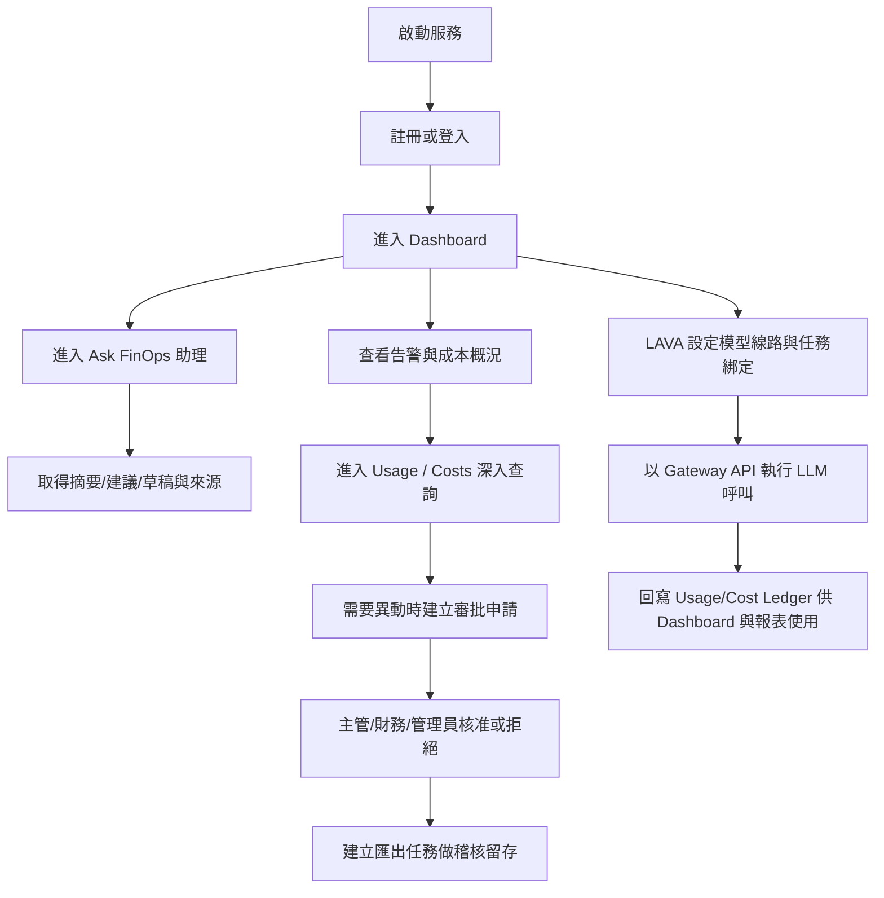

<!-- File Path: user使用流程.md -->
<!-- Timestamp: 2026-05-26T12:00:00+08:00 -->
<!-- Version: v0.3 -->

# User 使用流程手冊（詳細版）

文件用途：提供系統管理者與一般使用者一份可直接照做的操作 SOP，涵蓋首次上線、日常使用、權限邊界、LAVA 設定、以及 API-only 管理流程。

適用系統：LLM API FinOps V1.1（Frontend + Backend）

---

## 1. 系統入口與前置條件

### 1.1 服務入口
- 前端入口：http://localhost:5173
- 後端 API 文件：http://localhost:18001/docs
- 健康檢查：http://localhost:18001/healthz

### 1.2 預設管理帳號
- Email：admin@example.com
- Password：ChangeThisPassword!

首次啟動後建議立即建立新帳號並更新預設帳號密碼策略。

### 1.3 登入前必要條件
1. Docker 服務已正常啟動。
2. 資料庫已初始化（可透過 /healthz 確認）。
3. 使用者帳號狀態為 ACTIVE。

---

## 2. 角色與資料範圍規則

## 2.1 角色清單
- ADMIN
- FINANCE
- MANAGER
- EMPLOYEE
- AUDITOR
- SECURITY

### 2.2 可見資料範圍（Scope）
- ADMIN / FINANCE / SECURITY：可見全域部門資料。
- MANAGER：可見自己部門與子部門資料。
- EMPLOYEE / AUDITOR：可見自己部門資料。

### 2.3 寫入權限重點
- 使用者管理（建立/修改）：ADMIN
- 部門建立：ADMIN；部門修改：ADMIN、MANAGER
- 專案建立/修改：ADMIN、MANAGER
- API Key 建立/輪替/停用：ADMIN、SECURITY
- AI Account 建立/修改：ADMIN、FINANCE
- AI Account 指派/回收：ADMIN、MANAGER
- 模型建立/修改：ADMIN
- 模型價格建立：ADMIN、FINANCE
- 審批核准/拒絕：ADMIN、MANAGER、FINANCE
- 匯出任務建立：ADMIN、FINANCE、MANAGER
- LAVA Connection / Binding 管理：ADMIN、MANAGER、SECURITY
- LAVA Runtime（CPU/Workers）設定：ADMIN、SECURITY

---

## 3. 全流程總覽

---

## 4. 首次使用流程（新使用者）

### 4.1 註冊帳號
1. 進入登入頁後點選「註冊新帳號」。
2. 填寫姓名、Email、密碼、確認密碼。
3. 可選擇部門；不選時系統會使用預設有效部門。
4. 員工編號可留空（系統自動產生）。
5. 按「建立帳號」。

註冊成功後：
- 系統會建立 EMPLOYEE 角色帳號。
- 帳號狀態預設 ACTIVE。
- 寫入 USER_REGISTER 稽核紀錄。

### 4.2 登入系統
1. 回登入頁輸入 Email / Password。
2. 成功後系統儲存 access_token 到瀏覽器 localStorage。
3. 自動導向 /dashboard。

登入失敗常見原因：
- 帳密錯誤（401）。
- 使用者非 ACTIVE（401）。

---

## 5. 日常操作流程（前端 UI）

注意：目前多數頁面以查詢為主；部分建立/修改功能尚未在前端表單開放，需走 API（見第 6 章）。

### 5.1 Dashboard（/dashboard）
目的：快速掌握今日與本月 token/cost 與告警。

操作步驟：
1. 登入後進入 Dashboard。
2. 查看四張指標卡：今日 Tokens、今日成本、本月 Tokens、本月成本。
3. 查看告警中心表格（OPEN/ACKNOWLEDGED）。

API：
- GET /dashboard/summary
- GET /dashboard/alerts

### 5.2 Users（/users）
目的：查看使用者清單（分頁）。

操作步驟：
1. 點選 Users。
2. 可按「重新整理」。
3. 使用分頁瀏覽資料。

API：GET /users?page=&page_size=

### 5.3 Departments（/departments）
目的：查看部門清單（分頁）。

API：GET /departments?page=&page_size=

### 5.4 Projects（/projects）
目的：查看專案清單（分頁）。

API：GET /projects?page=&page_size=

### 5.5 API Keys（/api-keys）
目的：查看 API Key 資產清單（遮罩後 key、狀態、到期日）。

API：GET /api-keys?page=&page_size=

### 5.6 AI Accounts（/ai-accounts）
目的：查看 AI 帳號授權資產（vendor、plan、seats、monthly cost）。

API：GET /ai-accounts?page=&page_size=

### 5.7 Models（/models）
目的：查看模型主檔清單（provider/model_code/context/status）。

API：GET /models?page=&page_size=

### 5.8 Usage Events（/usage-events）
目的：查詢 LLM 呼叫明細（request、tokens、cost、status）。

操作步驟：
1. 可選日期區間（daterange）。
2. 點「查詢」。
3. 透過分頁瀏覽。

API：GET /usage-events

參數要點：
- 可傳 start_at / end_at。
- 預設為當月範圍。

### 5.9 Costs（/costs）
目的：檢視成本彙總與排行。

畫面區塊：
- 成本總覽（request_count、total_tokens、total_cost_usd）
- By Department
- By User
- By Model

API：
- GET /costs/summary
- GET /costs/by-department
- GET /costs/by-user
- GET /costs/by-model

### 5.10 Approvals（/approvals）
目的：查看審批請求清單與狀態。

注意：目前前端頁面為「查詢/列表」版本，未提供核准/拒絕按鈕。

API：GET /approval-requests?page=&page_size=

### 5.11 Exports（/exports）
目的：建立報表匯出任務並追蹤狀態。

操作步驟：
1. 進入 Exports。
2. 點「建立匯出任務」。
3. 系統建立 export_type=cost_ledger_csv 任務。
4. 表格顯示任務狀態與檔案路徑。

API：
- POST /exports
- GET /exports

### 5.12 Ask FinOps（/assistant）
目的：用單一聊天室入口完成 FinOps 問答、異常解釋、審批摘要、月報草稿與節省建議。

操作步驟：
1. 進入 Ask FinOps 頁面。
2. 輸入問題（例如成本異常、政策問答、審批摘要）。
3. 視需要選擇 context_type（auto/costs/usage/alerts/approval_request/policy）與 context_id。
4. 送出後查看右側資訊：primary_task_id、task_ids、sources、risk_level、suggested_actions。
5. 若顯示 BLOCKED，請依建議改走人工流程（例如 Approvals）。

關鍵 API：
- POST /assistant/chat

回應重點欄位：
- answer
- primary_task_id
- task_ids
- sources
- risk_level
- suggested_actions
- trace_id

### 5.13 Resource Governance（Phase 1，API 先行）
目的：補齊資產合約、非 Gateway 用量與 rolling limit 狀態。

目前狀態：
1. 後端 API 與前端查詢頁已可用。
2. 可直接在前端檢視合約/用量/限制相關資料。

涵蓋能力：
1. 合約管理（asset_contracts）：月付/年付/usage-based 與月攤提。
2. 非 Gateway 用量寫入（resource_usage_events）：可做人工或匯入記錄。
3. 資源限制狀態（resource_limit_states）：提供 5h/day/week/month token 視圖與門檻覆寫。

### 5.14 Resource Governance（Phase 2）
目的：補齊 ROI 與 Ask FinOps 對話歷程追溯。

涵蓋能力：
1. 使用目的主檔（usage_purposes）管理。
2. 產出與價值登錄（work_outputs）含 submit/approve/reject 狀態流。
3. ROI 分析（analytics/roi）只計入 APPROVED 產出。
4. Ask FinOps conversation/message 歷程保存與查詢。

### 5.15 Phase 3 前端頁面（已上線）
以下頁面可直接由左側選單進入：
1. Usage Purposes（/usage-purposes）：查詢與建立使用目的主檔。
2. Work Outputs（/work-outputs）：建立產出、送審、核准、拒絕。
3. ROI Analytics（/analytics-roi）：依部門/使用者/專案/資產查看 ROI。
4. Assistant History（/assistant-history）：檢視對話清單與訊息歷程。

驗收建議：
1. 先在 Usage Purposes 建立一筆 purpose。
2. 到 Work Outputs 建立一筆 DRAFT，執行 submit -> approve。
3. 到 ROI Analytics 確認 APPROVED 產出被納入。
4. 從 Ask FinOps 送出一筆對話，再到 Assistant History 檢視該 conversation。

---

## 6. API 管理流程（進階/批次維運）

以下流程建議由 ADMIN/SECURITY/FINANCE 透過 API 文件頁（/docs）或後台工具執行，適用於批次作業或前端未覆蓋細節。

### 6.1 使用者管理
- 建立使用者：POST /users（ADMIN）
- 更新使用者：PATCH /users/{user_id}（ADMIN）

### 6.2 部門管理
- 建立部門：POST /departments（ADMIN）
- 更新部門：PATCH /departments/{department_id}（ADMIN、MANAGER）

### 6.3 專案管理
- 建立專案：POST /projects（ADMIN、MANAGER）
- 更新專案：PATCH /projects/{project_id}（ADMIN、MANAGER）

### 6.4 API Key 全生命週期
- 建立：POST /api-keys（ADMIN、SECURITY）
- 更新屬性：PATCH /api-keys/{api_key_id}（ADMIN、SECURITY）
- 輪替：POST /api-keys/{api_key_id}/rotate（ADMIN、SECURITY）
- 停用：POST /api-keys/{api_key_id}/disable（ADMIN、SECURITY）

### 6.5 AI Account 全生命週期
- 建立：POST /ai-accounts（ADMIN、FINANCE）
- 更新：PATCH /ai-accounts/{account_id}（ADMIN、FINANCE）
- 指派：POST /ai-accounts/{account_id}/assign（ADMIN、MANAGER）
- 回收：POST /ai-accounts/{account_id}/revoke（ADMIN、MANAGER）

### 6.6 模型與價格
- 建立模型：POST /models（ADMIN）
- 更新模型：PATCH /models/{model_id}（ADMIN）
- 建立價格版本：POST /models/{model_id}/prices（ADMIN、FINANCE）

### 6.7 審批流
- 建立申請：POST /approval-requests（所有登入者可建立）
- 核准：POST /approval-requests/{request_id}/approve（ADMIN、MANAGER、FINANCE）
- 拒絕：POST /approval-requests/{request_id}/reject（ADMIN、MANAGER、FINANCE）

### 6.8 資產合約（Phase 1）
- 查詢：GET /asset-contracts（依 scope）
- 建立：POST /asset-contracts（ADMIN、FINANCE）
- 更新：PATCH /asset-contracts/{contract_id}（ADMIN、FINANCE）

合約規則：
1. 僅能綁一種資產（api_key_id 或 ai_account_id 擇一）。
2. MONTHLY 只允許 monthly_fee_usd。
3. YEARLY 只允許 yearly_fee_usd，monthly_amortized_usd 由系統換算。
4. USAGE_BASED 不填固定月費/年費。

### 6.9 非 Gateway 用量（Phase 1）
- 查詢：GET /resource-usage-events（依 scope）
- 建立：POST /resource-usage-events（ADMIN、FINANCE、MANAGER）

說明：
1. 事件建立後會同步重算對應資產的 resource_limit_states。
2. 支援 event_source + external_event_id 去重。

### 6.10 資源限制狀態（Phase 1）
- 查詢：GET /resource-limits（依 scope）
- 覆寫：PATCH /resource-limits/{id}（ADMIN、FINANCE、SECURITY）

Hybrid 補充：
1. Gateway 成功寫入 usage/cost 後會即時更新 resource_limit_states。
2. Worker 每 5 分鐘做一次重算校正。

### 6.11 使用目的與產出管理（Phase 2）
- 使用目的查詢：GET /usage-purposes
- 使用目的建立：POST /usage-purposes（ADMIN、FINANCE）
- 產出查詢：GET /work-outputs（依 scope）
- 產出建立：POST /work-outputs（登入者）
- 送審：POST /work-outputs/{id}/submit（擁有者或管理角色）
- 核准：POST /work-outputs/{id}/approve（ADMIN、MANAGER、FINANCE）
- 拒絕：POST /work-outputs/{id}/reject（ADMIN、MANAGER、FINANCE）

狀態流：
1. DRAFT -> SUBMITTED -> APPROVED / REJECTED。
2. 只有 APPROVED 會納入官方 ROI 統計。

### 6.12 ROI 與 Assistant 對話歷程（Phase 2）
- ROI：GET /analytics/roi
  - 支援 group_by=department|user|project|asset
  - 可帶 start_at/end_at 時間區間

- Assistant 對話：
  - 對話問答：POST /assistant/chat
  - 對話清單：GET /assistant/conversations
  - 訊息清單：GET /assistant/conversations/{conversation_id}/messages

說明：
1. 同一使用者 + 同一 session_id 會延續同一 conversation。
2. BLOCKED 請求同樣會保留歷程（但不會呼叫模型）。
3. 訊息內容會先做敏感資訊遮罩再儲存。

---

## 7. LAVA 使用流程（詳細）

LAVA 的定位：管理「真正會呼叫 LLM」的任務線路、模型與測試，不負責 dashboard/costs/export/worker 的 deterministic 邏輯。

### 7.1 進入 LAVA
路徑：/lava-setup

畫面區塊：
1. Connection 管理
2. 任務綁定
3. Runtime Setup

### 7.2 Connection 管理 SOP
1. 點「新增線路」建立草稿 connection。
2. 選擇 vendor（openrouter/openai/google）。
3. 輸入或更新 API Key（儲存後會遮罩）。
4. 點 Fetch Models 抓取可用模型。
5. 選 Model Name。
6. 點「儲存線路」。
7. 點「測試線路」確認 API 可用。

關鍵 API：
- GET /lava/connection/list
- POST /lava/connection/create
- POST /lava/connection/update
- POST /lava/connection/fetch-models
- POST /lava/connection/test
- DELETE /lava/connection/{conn_id}

權限：
- 新增/更新/刪除：ADMIN、MANAGER、SECURITY
- 列表/抓模型/測試：已登入者

### 7.3 任務綁定 SOP
目前僅允許以下 6 個 LLM 任務：
1. gateway_chat
2. approval_request_summarize
3. cost_anomaly_summarize
4. usage_policy_qa
5. monthly_report_draft
6. token_saving_advice

操作步驟：
1. 在任務列選擇 Connection。
2. 如需凍結設定，按 Lock。
3. 如需變更，先 Unlock 再調整。
4. 按 Test 驗證綁定線路可用。

關鍵規則：
- 非白名單 task_id 會被拒絕（Unsupported task_id）。
- 例如 approval_request_decide 不允許綁定。

關鍵 API：
- GET /lava/binding/list
- POST /lava/binding/update
- POST /lava/binding/lock
- POST /lava/binding/unlock
- POST /lava/binding/test

### 7.4 Runtime Setup SOP
1. 設定 CPU Cores（auto 或固定核心數）。
2. 設定 Flow A Workers。
3. 按套用後再次刷新確認 effective 值。

關鍵 API：
- GET /lava/runtime/cpu
- POST /lava/runtime/cpu
- GET /lava/runtime/flowa_workers
- POST /lava/runtime/flowa_workers

權限：
- 查詢：已登入者
- 更新：ADMIN、SECURITY

---

## 8. Gateway Chat 呼叫流程（整合方必讀）

當外部系統要真正呼叫 LLM，請使用：POST /gateway/chat

### 8.1 請求必要欄位
- request_id（8~80）
- idempotency_key（8~80）
- provider_code
- model_code
- project_id（可選）
- message
- metadata_json（可選）

### 8.2 處理順序
1. 檢查 request_id / idempotency_key 是否重複。
2. 驗證 provider/model 是否存在且啟用。
3. 選取對應部門可用 API Key。
4. 估算 token/cost，執行預算檢查。
5. 建立 reservation。
6. 執行 rate limit 檢查。
7. 呼叫 provider。
8. 成功後寫入 usage_event + cost_ledger + audit log。
9. 回傳 answer、usage、remaining_budget_usd。

### 8.3 常見錯誤
- 403 NO_ACTIVE_API_KEY：部門沒有可用 key。
- 403 BUDGET_HARD_LIMIT_EXCEEDED：超出硬上限。
- 409 MODEL_PRICE_NOT_FOUND：模型沒有有效價格。
- 409 REQUEST_ALREADY_IN_PROGRESS：同一請求進行中。
- 429 RATE_LIMIT_EXCEEDED：頻率超限。
- 502 PROVIDER_*：上游模型服務失敗。

---

## 9. 推薦日常作業節奏

### 9.1 Admin/Manager 每日
1. Dashboard 看今日成本與告警。
2. Usage 看異常 request 與 latency。
3. Costs 看部門/人員/模型排行。
4. Exports 建立成本台帳匯出。
5. 必要時調整專案、部門、LAVA 綁定。

### 9.2 Security 每日
1. 檢查 API Key 到期與狀態。
2. 按政策輪替高風險 key。
3. 檢查 LAVA 連線是否使用合規模型。

### 9.3 Finance 每日
1. 驗證成本趨勢與預算壓力。
2. 建立匯出報表給財務對帳。
3. 參與高成本相關審批決策。

### 9.4 Employee/Auditor 每日
1. 查看本部門 usage/cost 概況。
2. 若需異動資源，建立 approval request。
3. 追蹤申請狀態。

---

## 10. 常見問題排查

### 10.1 登不進去
- 確認帳號是否 ACTIVE。
- 確認密碼正確。
- 確認 localStorage 中 token 是否過期，必要時登出重登。

### 10.2 頁面顯示 403
- 角色不符合 require_roles。
- 或目前角色的部門 scope 不包含目標資料。

### 10.3 LAVA 綁定失敗
- task_id 非允許白名單。
- binding 已鎖定（需先 unlock）。
- connection 未設定 model/API key。

### 10.4 Gateway 回 409/429/502
- 409：重複請求或模型價格缺失。
- 429：短時間流量過高。
- 502：上游模型服務異常，建議重試或切換線路。

### 10.5 Ask FinOps 回覆異常
- 顯示 BLOCKED：代表提問涉及高風險狀態變更（如核准、停用、刪除、調預算），請改走人工流程。
- 顯示「尚未綁定可用 Connection」：請至 LAVA Setup 為對應 task 綁定有效線路。
- 回覆「模型服務暫時無法回應」：通常是上游模型或線路問題，先檢查 LAVA 連線測試與 API Key 狀態。

---

## 11. 上線前人工檢查清單（操作面）

1. 能註冊新帳號並成功登入。
2. Dashboard / Usage / Costs 可正常載入。
3. Exports 能建立任務並看到狀態變化。
4. LAVA 線路可新增、抓模型、測試連線。
5. LAVA 任務綁定僅有 6 個 LLM 任務。
6. approval_request_decide 會被拒絕綁定。
7. Gateway/chat 能成功回應並落 usage/cost。
8. /assistant 可正常送出問題並回傳 answer/task_ids/sources/risk_level。
9. 高風險請求（如「幫我核准」、「停用 key」、「調高預算」）在 /assistant 會回 BLOCKED。

---

## 12. 補充說明

- 本文件是依目前程式實作整理，若後續新增前端可寫入表單（如 Users/Departments/Projects 編輯），請同步更新此文件。
- 若公司有正式 SOP/ISO 文件，建議將本手冊作為系統操作附錄，並搭配權限變更流程一起管理。
